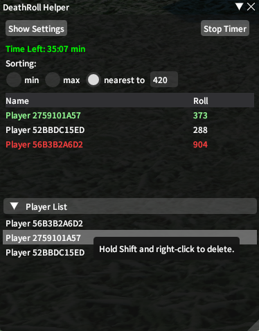
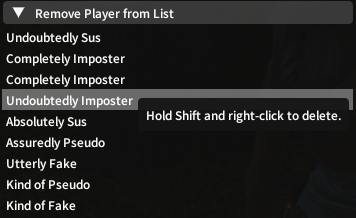
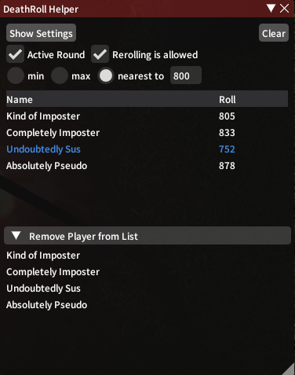
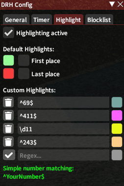

# DeathRoll

Plugin to help with a number of /random and /dice related games.

## Game Modes
### Venue Mode:
+ Concise display of all concurrent players in a list-based format
+ Includes functionality for Truth or Dare and Giveaway modes
+ Support for multiple sorting types (min, max, nearest to)
+ Highlight numbers based on regex matching
### Death Roll Mode:
+ Support for multiple players
+ Automatically checks for correct number ranges from each player
### Tournament Mode:
+ 1 vs 1 Death Roll Tournament
+ Automatic bracket generation
+ Uneven number of players get filled with byes
+ Randomization via shuffling is enforced
+ Forfeit functionality if a player needs to leave
### Blackjack Mode:
+ Support for all normal moves
+ Automatic reward calculation based on standard rules
+ Simplistic, visual view of cards in play
+ Automatic drawing of cards, or manual player based roll for cards
+ Current players can be seemlessly moved to subsequent rounds
+ Further support for custom rules is planned (For example, the dealer can hit above 16)

## Features
+ Can block or prevent players from partaking in any of your games
+ Accepts only /random or /dice commands
+ Ease of removing players from partaking in the concurrent game/tournament
  
### Note
> Includes language (parsing) support for English, German and French FFXIV clients. (Japanese support is planned)  
  
More features are planned for future updates in accordance with feedback.

## Screenshots

### Result Table (randomized names)

### Remove Players

### Different Sorting (nearest to 800)

### Highlighting UI

## Thanks to
BluBb_mADe, JudgeZarbi

Fonts used:  
[JetBrains Mono](https://github.com/JetBrains/JetBrainsMono)  
[Source Code Pro](https://github.com/adobe-fonts/source-code-pro)
