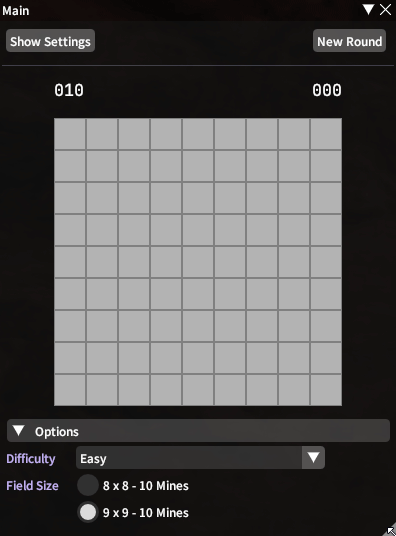

# DeathRoll

Plugin to help with a number of dice games.  
Also offers games like Tic-Tac-Toe and Minesweeper.

## Modes
### Venue:
- Concise display of all concurrent players in a list-based format
- Supports multiple sorting types (min, max, nearest to)
- Highlight numbers based on regex matching

### DeathRoll:
- Supports multiple players
- Automatic checks to prevent number skipping

### Tournament (1v1 DeathRoll):
- Automatic bracket generation with byes to fill uneven
- Forfeit functionality if a player needs to leave

### Blackjack:
- Automatic reward calculation based on common rules
- Simplistic, or visual view of cards in play
- Automatic or manual player-based draw for cards

### Extra Features:
- Block or prevent players from partaking in any game
- Accept only /random or /dice commands

----

## Games
### Tic-Tac-Toe
- Play against your friends, or AI
- Easy, Medium, Hard
- 3x3, 4x4, 5x5

### Minesweeper
- Easy, Medium, Hard
- 8x8, 9x9, 16x16, 18x30
- Custom Games (planned)

More features are planned, following user feedback.

## Screenshots

### Venue

### Tournament Bracket

### Blackjack Cards

### Tic-Tac-Toe

### Minesweeper

### Highlight Config UI

## Thanks to
BluBb_mADe, JudgeZarbi

Fonts used:  
[JetBrains Mono](https://github.com/JetBrains/JetBrainsMono)  
[Source Code Pro](https://github.com/adobe-fonts/source-code-pro)
