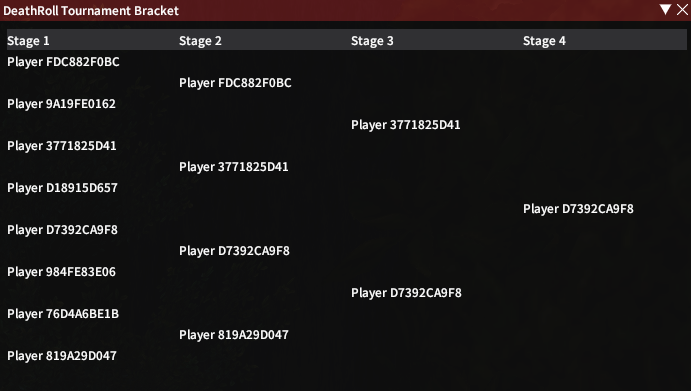
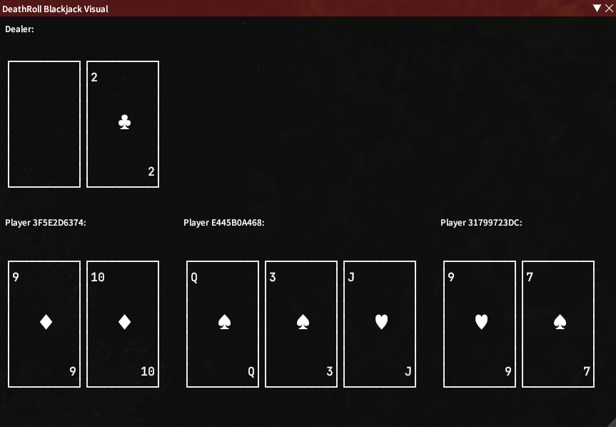

# DeathRoll

Plugin to help with several /random and /dice-related games.

## Modes
###Venue:
+ Concise display of all concurrent players in a list-based format
+ Supports multiple sorting types (min, max, nearest to)
+ Highlight numbers based on regex matching

###DeathRoll:
+ Supports multiple players
+ Automatic checks to prevent number skipping

###Tournament (1v1 DeathRoll):
+ Automatic bracket generation with byes to fill uneven
+ Forfeit functionality if a player needs to leave

###Blackjack:
+ Automatic reward calculation based on common rules
+ Simplistic, or visual view of cards in play
+ Automatic or manual player-based draw for cards
+ Current players can be seamlessly moved to subsequent rounds
+ Configurable dealer rules (like Soft16)

###Extra Features:
+ Block or prevent players from partaking in any game
+ Accept only /random or /dice commands

More features are planned, following user feedback.

## Screenshots

### Venue

### Tournament Bracket

### Blackjack Cards

### Tic-Tac-Toe

### Highlight Config UI

## Thanks to
BluBb_mADe, JudgeZarbi

Fonts used:  
[JetBrains Mono](https://github.com/JetBrains/JetBrainsMono)  
[Source Code Pro](https://github.com/adobe-fonts/source-code-pro)
